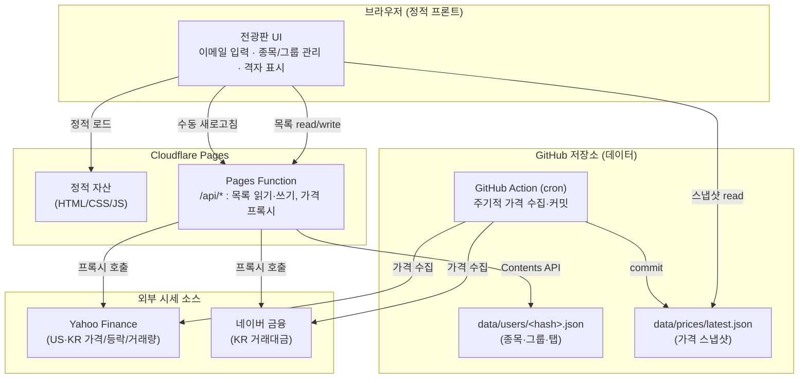

# feat: 주식 전광판 (Stock Big Board) 구현

## 요약

이메일만 입력하면 어디서든 접속하는 개인용 주식 전광판 웹앱을 그린필드로 구축한다. 최대 5명이 각자 자기 종목판(한국·미국 종목)을 그룹/탭으로 정리하고, 종목명·현재가·등락폭·등락률·거래량·거래대금을 한국식 색(상승🔴/하락🔵) 격자로 본다. 가격은 수동 새로고침 + 주기적 스냅샷으로 갱신한다. 정적 프론트엔드 + Cloudflare Pages Functions 1개 + GitHub 저장소(데이터) 구조로 완전 무료 운영한다. (origin: `docs/brainstorms/2026-05-31-stock-bigboard-requirements.md`)

---

## 문제 정의 (Problem Frame)

키움 HTS 전광판은 Windows 데스크톱에 묶여 있어 폰·외부 PC에서 볼 수 없다. 목표는 "내 관심 종목을 시장·그룹별로 정리해 어디서나 가격을 확인하는 보드"이며, 실시간 매매가 아닌 **가격 확인·정리** 용도다. 본인 포함 최대 5명의 신뢰 그룹이 각자 자기 목록을 갖고 가볍게 사용한다.

정적 사이트의 본질적 제약(서버 없음 → 브라우저에서 GitHub 쓰기 불가, 비밀 토큰 노출 위험)을 작은 서버 함수 1개로 해소하는 것이 핵심 설계 과제다.

---

## 요구사항 추적 (Requirements)

origin 문서의 성공 기준을 그대로 계승한다:

- **R1** — 이메일 입력만으로 어떤 기기·장소에서든 내 종목판이 로드된다. (origin 성공기준 1, 4)
- **R2** — 종목을 추가/삭제하고 그룹·탭으로 분류해 정리할 수 있다. (origin 성공기준 2)
- **R3** — 각 종목의 종목명·현재가·등락폭·등락률·거래량·거래대금이 전광판 격자로 보인다. (origin 성공기준 3)
- **R4** — 한 기기에서 편집한 목록이 다른 기기에서도 동기화된다. (origin 성공기준 4)
- **R5** — 운영 비용 0원, 5명 동시 접속에도 안정적. (origin 성공기준 5)
- **R6** — 가격은 수동 새로고침 + 주기적 자동 스냅샷으로 갱신(실시간 아님). (origin 성공기준 6)
- **R7** — 한국식 색 관례(상승 빨강 / 하락 파랑)를 KR·US 공통 적용. (origin 핵심 결정)

---

## 핵심 기술 결정 (Key Technical Decisions)

- **KTD1 — 호스팅: Cloudflare Pages + Pages Functions.** 프론트(정적)와 서버 함수를 한 계정·한 배포에 통합. 도메인·CORS·프록시가 하나로 해결되고 설정이 가장 단순. (사용자 선택; origin 미해결질문 "GitHub Pages vs Cloudflare Pages" 해소)
- **KTD2 — 데이터 저장: GitHub 저장소의 이메일별 JSON 파일.** 별도 DB 없음. Pages Function이 GitHub Contents API로 읽기/쓰기. 토큰은 Cloudflare 환경변수(secret)에 보관해 노출 방지. (origin "GitHub으로 데이터 관리" 충족)
- **KTD3 — 가격 갱신 이원화.** ① 주기적 스냅샷: GitHub Action 스케줄 cron이 전 사용자 종목의 합집합 가격을 받아 저장소에 커밋. ② 즉시 새로고침: Pages Function이 Yahoo/네이버를 실시간 프록시. (origin 미해결질문 "스냅샷 주기·실행 주체" 해소)
- **KTD4 — 데이터 소스: Yahoo Finance + 네이버 금융.** US·KR 가격·등락·등락률·거래량은 Yahoo `query1` 차트 엔드포인트(KR은 `.KS`/`.KQ` 접미사), KR 거래대금은 네이버 금융 엔드포인트. 둘 다 Pages Function이 서버에서 호출(CORS 우회·IP 분산). 비공식 소스라 깨질 위험은 Risks에 명시. (origin B안 선택)
- **KTD5 — 미국 거래대금은 `현재가 × 거래량` 근사.** Yahoo가 거래대금 미제공 → 근사값으로 표시하고 근사임을 UI에 라벨. 한국은 네이버 실제 거래대금. (origin 미해결질문 해소)
- **KTD6 — 이메일은 약한 식별 키.** 비밀번호 없음. 이메일을 정규화(소문자·trim)해 파일 키로 사용. 5명 신뢰 그룹 전제. (origin 가정 2)
- **KTD7 — 쓰기 충돌 처리.** Pages Function이 GitHub Contents API의 파일 SHA를 읽고 갱신, 409 충돌 시 1회 재시도. 5명·드문 편집이라 충돌 확률 극히 낮음. (origin 미해결질문 "동시 편집 충돌" 해소)

---

## 상위 기술 설계 (High-Level Technical Design)

### 컴포넌트 / 데이터 흐름



### 페이지 로드 시 가격 표시 전략

1. 첫 화면: 저장소의 `data/prices/latest.json` 스냅샷을 즉시 표시(빠름, API 호출 0).
2. "새로고침" 클릭: Pages Function이 해당 사용자 종목만 실시간 프록시 → UI 갱신.
3. 백그라운드: GitHub Action이 주기적으로 스냅샷을 최신화(다음 로드부터 반영).

> 위 다이어그램·전략은 설계 방향 안내이며, 정확한 엔드포인트·필드 매핑은 구현 시 확정한다.

---

## 출력 구조 (Output Structure)

```
prj-bigboard/
├─ public/                  # Cloudflare Pages 정적 루트
│  ├─ index.html            # 전광판 단일 페이지
│  ├─ css/board.css         # 전광판 스타일(한국식 색)
│  └─ js/
│     ├─ app.js             # 진입·라우팅·상태
│     ├─ api.js             # /api/* 호출 래퍼
│     └─ board.js           # 격자 렌더링·정렬 표시
├─ functions/
│  └─ api/
│     ├─ list.js            # GET/PUT 사용자 종목·그룹
│     └─ quotes.js          # GET 실시간 가격 프록시(Yahoo/네이버)
├─ data/
│  ├─ users/.gitkeep        # <hash>.json 사용자 파일
│  └─ prices/latest.json    # 스냅샷
├─ scripts/
│  └─ snapshot.mjs          # 가격 수집 스크립트(Action에서 실행)
├─ .github/workflows/
│  └─ snapshot.yml          # 스케줄 cron
└─ wrangler.toml            # Cloudflare Pages/Functions 설정
```

> 트리는 예상 형태(scope 선언)이며, 구현 중 더 나은 배치가 보이면 조정 가능. 각 유닛의 **Files**가 최종 기준.

---

## 구현 유닛 (Implementation Units)

### U1. 프로젝트 스캐폴딩 + Cloudflare Pages 설정

- **Goal**: 빈 저장소에 디렉터리 구조·Cloudflare Pages/Functions 설정·로컬 개발 환경을 세운다.
- **Requirements**: R5 (무료·배포 기반)
- **Dependencies**: 없음
- **Files**: `wrangler.toml`, `package.json`, `public/index.html`(빈 골격), `data/users/.gitkeep`, `data/prices/latest.json`(`{}` 초기값), `.gitignore`, `README.md`
- **Approach**: Cloudflare Pages 프로젝트 + `functions/` 디렉터리 규약. `wrangler pages dev`로 로컬에서 정적+함수 동시 구동. GitHub 토큰 등 시크릿은 Cloudflare 환경변수로 주입(코드/저장소에 미포함).
- **Patterns to follow**: 없음(그린필드) — Cloudflare Pages Functions 공식 디렉터리 규약 준수.
- **Test scenarios**: Test expectation: none — 순수 스캐폴딩·설정. 검증은 `wrangler pages dev` 기동 확인으로 대체.
- **Verification**: `wrangler pages dev`가 로컬에서 빈 페이지를 서빙하고 `/api/*` 라우팅이 인식됨.

### U2. 가격 프록시 함수 (Yahoo + 네이버) — 데이터 소스 검증 포함

- **Goal**: 종목 코드 목록을 받아 Yahoo(US·KR)·네이버(KR 거래대금)에서 가격을 받아 공통 스키마로 정규화해 반환하는 `/api/quotes`를 만든다.
- **Requirements**: R3, R5, R6
- **Dependencies**: U1
- **Files**: `functions/api/quotes.js`, `functions/api/quotes.test.js`
- **Approach**: 입력은 `[{market: 'KR'|'US', code}]`. KR은 Yahoo `005930.KS`/`.KQ`, US는 무접미사로 `query1.finance.yahoo.com/v8/finance/chart/...` 호출. KR 거래대금은 네이버 금융 엔드포인트 추가 호출로 병합. 출력 공통 스키마: `{code, name, price, change, changePct, volume, tradingValue, approxTradingValue:boolean}`. US 거래대금은 `price×volume` 근사(`approxTradingValue:true`). 외부 호출 실패 시 해당 종목만 `null` 필드로 표시하고 전체는 200 유지.
- **Execution note**: 가장 먼저 실제 Yahoo/네이버 응답을 받아 현재 포맷을 확인하는 통합 테스트부터 작성(브레인스토밍 리서치 기준 포맷이 바뀌었을 수 있으므로 실호출 검증 우선).
- **Patterns to follow**: 없음 — origin Sources의 Yahoo/네이버 엔드포인트 패턴 참조.
- **Test scenarios**:
  - 해피패스: KR 단일 종목 → 6개 필드(거래대금 포함) 정상 반환.
  - 해피패스: US 단일 종목 → 거래대금이 `approxTradingValue:true`로 근사 반환.
  - 혼합: KR+US 여러 종목 동시 요청 → 시장별로 올바른 소스 호출·병합.
  - 엣지: 존재하지 않는 코드 → 해당 항목만 `null` 필드, 200 유지.
  - 실패경로: Yahoo가 비정상 응답/타임아웃 → 부분 실패 처리, 다른 종목은 정상.
  - 실패경로: 네이버 거래대금 호출만 실패 → 가격은 Yahoo로 채우고 거래대금만 `null`.
- **Verification**: 실제 종목 코드로 호출 시 6개 필드가 채워지고, KR 거래대금이 네이버 값과 일치, US는 근사 플래그가 셋됨.

### U3. GitHub 기반 사용자 목록 저장 (`/api/list`)

- **Goal**: 이메일별 종목·그룹·탭을 GitHub 저장소 파일로 읽고 쓰는 함수를 만든다.
- **Requirements**: R1, R2, R4, R7(색은 표시 단계지만 그룹 데이터에 시장 구분 포함)
- **Dependencies**: U1
- **Files**: `functions/api/list.js`, `functions/api/list.test.js`
- **Approach**: GET `?email=` → 정규화 후 `sha256(email)` 파일 키로 `data/users/<hash>.json` 읽기(없으면 빈 구조 반환). PUT → 전체 목록 본문을 받아 Contents API로 커밋. 저장 스키마: `{groups:[{id,name,market,tickers:[{market,code,name}]}], updatedAt}`. 쓰기 시 기존 파일 SHA 조회 후 갱신, 409 시 최신 SHA로 1회 재시도. GitHub 토큰은 환경변수에서 로드.
- **Execution note**: 쓰기→읽기 왕복 통합 테스트 우선(실제 커밋이 반영되는지).
- **Patterns to follow**: U2의 함수 구조·에러 처리 컨벤션 재사용.
- **Test scenarios**:
  - 해피패스: 신규 이메일 GET → 빈 구조 반환.
  - 해피패스: PUT로 그룹·종목 저장 → 같은 이메일 GET 시 동일 데이터(R4 동기화 근거).
  - 엣지: 이메일 대소문자·공백 차이 → 동일 키로 정규화돼 같은 파일 접근(KTD6).
  - 엣지: 빈 그룹/빈 종목 목록 저장 → 유효하게 저장·복원.
  - 실패경로: 잘못된 토큰/권한 → 명확한 5xx, 본문 미손상.
  - 통합: 동시 PUT 2건(SHA 충돌) → 1회 재시도로 후속 쓰기 성공 또는 명확한 충돌 응답.
- **Verification**: 두 다른 기기(브라우저 세션)에서 같은 이메일로 같은 목록이 보임.

### U4. 주기적 가격 스냅샷 (GitHub Action)

- **Goal**: 스케줄에 따라 전 사용자 종목의 합집합 가격을 받아 `data/prices/latest.json`에 커밋한다.
- **Requirements**: R6, R5
- **Dependencies**: U2, U3
- **Files**: `scripts/snapshot.mjs`, `.github/workflows/snapshot.yml`
- **Approach**: `data/users/*.json`을 모두 읽어 종목 합집합 산출 → U2와 동일한 시세 수집 로직(공유 모듈로 추출) → `latest.json`에 `{updatedAt, quotes:{<market:code>: {...}}}` 형태로 커밋. cron은 장중 시간대(KR 09:00–15:30 KST, US 09:30–16:00 ET)에 약 10분 간격. GitHub Action 스케줄은 분 단위 정밀도가 낮아 ±수분 지연될 수 있음(즉시성은 수동 새로고침이 담당).
- **Execution note**: U2의 시세 수집 코어를 `scripts/`와 `functions/`가 공유하도록 모듈 분리 후 진행.
- **Patterns to follow**: U2의 정규화 스키마 재사용.
- **Test scenarios**:
  - 해피패스: 사용자 파일 2개의 종목 합집합이 중복 없이 수집됨.
  - 엣지: 사용자 파일 0개 → 빈 스냅샷 커밋(에러 아님).
  - 엣지: 일부 종목 시세 실패 → 성공분만 스냅샷에 반영, 실패는 로그.
  - 통합: 워크플로 실행 후 `latest.json`이 갱신 커밋으로 반영됨.
- **Verification**: Action 수동 트리거 시 `latest.json`이 최신 가격으로 커밋되고 프론트 첫 로드에 반영됨.

### U5. 프론트엔드 — 이메일 진입 + 보드 로드

- **Goal**: 이메일 입력 화면과, 입력 시 해당 사용자 목록 + 스냅샷 가격으로 보드를 로드하는 흐름을 만든다.
- **Requirements**: R1, R4
- **Dependencies**: U3, U4
- **Files**: `public/index.html`, `public/js/app.js`, `public/js/api.js`, `public/js/app.test.js`
- **Approach**: 이메일 입력 → `localStorage`에 기억(편의) → `/api/list?email=`로 목록 로드 + `data/prices/latest.json` 로드 → 병합 렌더. 이메일 변경/로그아웃 가능. 첫 방문(빈 목록) 시 안내 표시.
- **Test scenarios**:
  - 해피패스: 유효 이메일 입력 → 목록·스냅샷 로드 후 보드 표시.
  - 엣지: 종목이 없는 신규 이메일 → 빈 상태 안내 표시.
  - 엣지: 이메일 형식 비정상 → 입력 검증 메시지.
  - 통합: 재방문 시 `localStorage`로 이메일 자동 채움, 다른 기기에선 동일 목록(서버 기준).
- **Verification**: 이메일 입력만으로 내 보드가 뜨고, 새 기기에서도 같은 목록이 로드됨.

### U6. 프론트엔드 — 종목 추가/삭제 + 그룹/탭 관리

- **Goal**: 종목을 추가·삭제하고 그룹/탭으로 분류하며, 변경을 `/api/list` PUT으로 저장(동기화)한다.
- **Requirements**: R2, R4
- **Dependencies**: U5
- **Files**: `public/js/app.js`(확장), `public/js/api.js`(확장), `public/js/groups.test.js`
- **Approach**: 그룹 생성/이름변경/삭제, 탭 전환, 종목 추가(시장 선택 KR/US + 코드/이름), 종목 삭제·다른 그룹 이동. 각 변경 후 전체 목록 PUT 저장. 저장 실패 시 사용자에 알림·로컬 상태 롤백.
- **Test scenarios**:
  - 해피패스: 그룹 생성 후 종목 추가 → 저장 → 새로고침해도 유지.
  - 해피패스: 탭 전환 시 해당 그룹 종목만 표시.
  - 엣지: 같은 종목 중복 추가 방지.
  - 엣지: 마지막 종목 삭제 시 빈 그룹 정상 표시.
  - 실패경로: PUT 저장 실패 → 사용자 알림 + 로컬 상태 롤백.
  - 통합: 추가→저장→다른 세션 로드 시 반영(R4).
- **Verification**: 종목·그룹 변경이 저장되고 다른 기기에서 동기화됨.

### U7. 프론트엔드 — 전광판 격자 표시 + 수동 새로고침

- **Goal**: 종목을 6개 필드 격자로, 한국식 색 관례로 표시하고, 수동 새로고침으로 실시간 가격을 갱신한다.
- **Requirements**: R3, R6, R7
- **Dependencies**: U5, U2
- **Files**: `public/js/board.js`, `public/css/board.css`, `public/js/board.test.js`
- **Approach**: 격자 셀: 종목명·현재가·등락폭·등락률·거래량·거래대금. 등락 양수=빨강, 음수=파랑, 0=중립(KR·US 공통, R7). US 거래대금은 근사(`approxTradingValue`) 시 별 표시(*)·툴팁. "새로고침" 버튼 → `/api/quotes`로 현재 보이는 종목만 갱신·로딩 표시. 스냅샷 `updatedAt`을 화면에 노출.
- **Test scenarios**:
  - 해피패스: 6개 필드가 셀에 정확히 매핑.
  - 해피패스: 상승=빨강, 하락=파랑, 보합=중립 색 적용.
  - 엣지: US 근사 거래대금에 근사 표시(*) 노출.
  - 엣지: 가격 필드가 `null`(시세 실패) → 셀에 "—" 표시, 레이아웃 유지.
  - 해피패스: 새로고침 클릭 → `/api/quotes` 호출 후 값·시각 갱신.
  - 통합: 스냅샷 로드 → 새로고침 → 값 변화가 화면에 반영.
- **Verification**: 키움 전광판과 유사한 격자가 한국식 색으로 표시되고, 새로고침이 동작하며, 5개 세션 동시 접속에도 정상.

---

## 범위 경계 (Scope Boundaries)

### 보류 (Deferred for later) — origin에서 계승
- 정렬(등락률·거래량 기준), 필터(상승만 보기 등).
- 이메일 약점 보완(PIN·매직링크 등 간단 인증).
- 52주 고저점 등 추가 지표.

### 후속 작업으로 이연 (Deferred to Follow-Up Work) — 계획 단계 판단
- 종목 코드 자동완성/검색(현재는 시장+코드 직접 입력).
- 사용자별 색·레이아웃 커스터마이즈.
- 스냅샷 이력 보관·차트(현재는 `latest.json` 1개만 유지).

### 범위 밖 (Out of Scope) — origin 계승
- 실시간 체결가(틱 갱신), 호가창, 차트, 매매/주문, 본격 인증(비밀번호/OAuth).

---

## 리스크 & 의존성 (Risks & Dependencies)

- **R-DATA(높음) — 비공식 시세 소스 취약성.** Yahoo/네이버는 비공식·약관 회색지대로 응답 포맷 변경·IP 차단 가능. 완화: 5명·저빈도 폴링, Pages Function/Action의 엣지 IP 사용, 부분 실패 허용 설계(U2). 깨질 경우 대안: 증권사 Open API(KIS/키움, 계좌 필요)로 소스 교체 — U2를 소스 추상화로 설계해 교체 비용 최소화. **U2에서 실호출 검증 선행 필수.**
- **R-AUTH(중간) — 약한 이메일 인증.** 남의 이메일을 알면 그 목록 접근 가능. 5명 신뢰 그룹 전제로 수용. 필요 시 "보류"의 PIN으로 보완.
- **R-CRON(낮음) — GitHub Action 스케줄 부정확.** ±수분 지연 가능. 즉시성은 수동 새로고침이 담당하므로 영향 제한적.
- **R-SECRET(중간) — GitHub 토큰 관리.** 쓰기 권한 토큰을 Cloudflare 환경변수에만 보관, 저장소·프론트 코드에 절대 미포함. fine-grained 토큰으로 해당 저장소 contents 권한만 부여 권장.
- **의존성**: Cloudflare 계정(Pages+Functions), GitHub 저장소 + fine-grained PAT, Node 런타임(스냅샷 스크립트).

---

## 미해결 질문 (구현 단계로 이연)

- Yahoo `query1` / 네이버 금융 엔드포인트의 **현재 정확한 응답 포맷·필드 경로** — U2에서 실호출로 확정.
- 스냅샷 cron의 정확한 시간대 표현(KST/ET 변환, 공휴일 처리) — U4 구현 시 단순 고정 간격으로 시작 후 조정.
- 종목명 소스(코드→이름 매핑) — Yahoo 응답의 `shortName` 사용 가능 여부를 U2에서 확인, 안 되면 사용자 입력 이름 사용.

---

## 출처 & 리서치 (Sources & Research)

데이터 소스 비교·선정 근거는 origin 문서의 리서치(2026-05-31, ce-web-researcher)에 기반:
- Yahoo Finance `query1.finance.yahoo.com/v8/finance/chart/{code}.KS|.KQ` — US·KR 가격/등락/거래량, 거래대금 미제공.
- 네이버 금융 — KR 거래대금 보완(비공식).
- 대안(이연): 한국투자증권(KIS) Open API — 6개 필드 전부·안정적, 단 증권 계좌 필요.
- Cloudflare Pages Functions — 정적+서버 함수 통합, 무료 티어.
