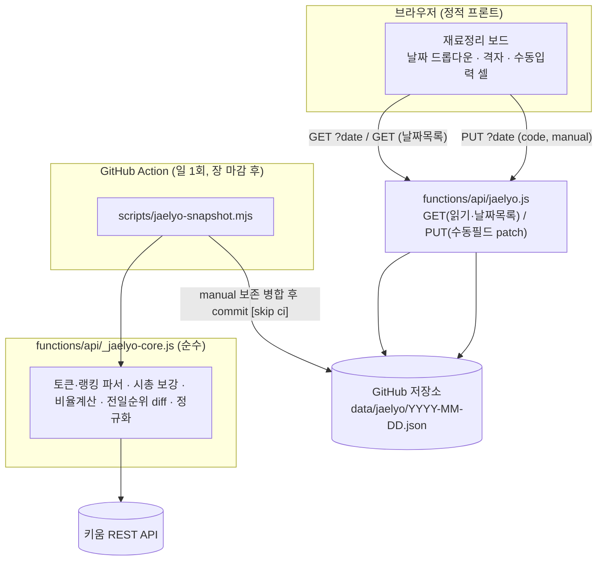

# feat: 일별 거래대금 상위 재료정리 보드

## 요약

기존 주식 전광판 화면 **아래**에, 대한민국 개장일마다 장 마감 후 **거래대금 상위 100종목**을 엑셀처럼 정리하는 "재료정리" 보드를 추가한다. 순위·전일순위·종목코드·종목명·현재가·등락률·시가총액·거래대금·시총대비 거래대금 비율은 키움 REST API에서 자동 수집하고, 신규/기존·테마·재료·재료지속성·재료연속여부·재무·수급은 사용자가 화면에서 직접 입력해 저장한다. 데이터는 단일 공용·날짜별 파일(`data/jaelyo/YYYY-MM-DD.json`)로 GitHub 저장소에 보관하며, 기존 가격 스냅샷과 동일하게 **GitHub Action 일 1회 수집 + Pages Function read/write** 구조를 따른다. 날짜는 드롭다운으로 선택하고, 등락률·시총·거래대금·시총대비비율 임계값을 넘는 셀은 배경색으로 강조한다.

참조: 사용자 정리 양식 이미지 `ref/매일_재료정리.png`

---

## 문제 정의 (Problem Frame)

사용자는 매 개장일 장 마감 후, 거래대금 상위 종목을 엑셀에 옮겨 등락률 순으로 정렬하고 테마·재료를 손으로 정리하는 작업을 반복해 왔다. 이 수작업의 **데이터 수집 부분(순위~거래대금, 시총대비 비율 계산)을 자동화**하고, **판단 부분(신규/기존·테마·재료 등)은 화면에서 바로 입력·저장**할 수 있게 하는 것이 목표다.

핵심 제약:
- 거래대금 **상위 랭킹**과 **시가총액**은 기존 앱이 쓰는 네이버/Yahoo 종목별 시세로는 한 번에 얻기 어렵다 → 별도 랭킹 소스(키움)가 필요하다.
- 랭킹 API는 **당일** 데이터만 제공 → 과거(2026-05-01~배포 이전) 소급 수집은 범위에서 제외, 배포 후 매일 전진 수집한다.
- 자동 수집 데이터와 사용자 수동 입력이 **같은 날짜 파일에 공존**하므로, 재수집이 수동 입력을 덮어쓰지 않아야 한다.

---

## 요구사항 추적 (Requirements)

- **R1** — 개장일마다 장 마감 후 거래대금 상위 100종목을 자동 수집한다. (순위·전일순위·종목코드·종목명·현재가·등락률·시가총액·거래대금)
- **R2** — 시총대비 거래대금 비율 = (거래대금 ÷ 시가총액 × 100)을 계산해 표시한다.
- **R3** — 신규/기존·테마·재료·재료지속성·재료연속여부·재무·수급 7개 항목을 사용자가 셀에서 직접 입력하면 저장된다.
- **R4** — 재수집 시에도 사용자의 수동 입력은 보존된다(종목코드 기준 병합).
- **R5** — 행은 등락률 높은 순으로 정렬해 표시한다. (순위 열은 거래대금 순위 유지)
- **R6** — 임계값 셀 배경 강조: 등락률 ≥ 10%, 시가총액 ≤ 2조원, 거래대금 ≥ 4천억원, 시총대비 비율 > 20.
- **R7** — 날짜를 드롭다운으로 선택해 해당일 보드를 본다.
- **R8** — 보드 영역은 사용자가 **세로로만** 크기를 조절할 수 있고, 내용이 많으면 스크롤된다.
- **R9** — 운영 비용 0원, 기존 무료 구조(GitHub 저장소 + Pages Functions + Action) 유지.

---

## 핵심 기술 결정 (Key Technical Decisions)

- **KTD1 — 데이터 소스: 키움 REST API.** OAuth로 access token 발급(`POST /oauth2/token`, appkey/secretkey) 후 거래대금상위 랭킹(API-ID `ka10032` 계열)을 호출해 상위 100종목을 얻는다. 키·시크릿은 코드에 두지 않고 **GitHub Actions Secret**(`KIWOOM_APPKEY`, `KIWOOM_SECRETKEY`)으로 주입한다. 기존 가격 스냅샷이 토큰 없이 동작하는 것과 달리, 이 수집은 인증이 필요하므로 수집 주체를 GitHub Action으로 둔다.
  - *실행 시점 확인 필요*: 키움 REST 엔드포인트 도메인(`api.kiwoom.com`)·정확한 API-ID·요청/응답 필드명·연속조회(`cont-yn`/`next-key`) 규약은 구현 시 키움 공식 문서로 검증한다. 계정/모의투자 여부에 따라 도메인이 다를 수 있다.
- **KTD2 — 시가총액은 별도 보강(enrich).** 거래대금상위 랭킹 응답에 시가총액이 없을 가능성이 높다. 상위 100 종목코드를 확보한 뒤 시가총액을 보강한다. **다중 코드 일괄 조회 엔드포인트가 있으면 우선 사용**하고, 없으면 종목별 기본정보 조회(`ka10001` 계열)를 **레이트리밋(예: 초당 약 5건) 스로틀**로 100회 호출한다. 정확한 엔드포인트·필드·호출수 제한은 구현 시 확정.
- **KTD3 — 단위 정규화는 코어에서 '원(KRW)'으로 통일.** 키움 거래대금은 백만원 단위(사용자가 언급한 4천억 = 400000)일 수 있고 시총 단위도 다를 수 있다. 파서가 **모두 원 단위로 환산**해 저장한다(거래대금 백만원 → ×1,000,000). 임계값은 정규화 후 적용: 시총 ≤ 2e12, 거래대금 ≥ 4e11, 시총대비비율 = 거래대금/시총×100 > 20. (4천억/2조 = 20% 와 일치 — `ref/매일_재료정리.png`의 23.60·22.45 등 값과 부합)
- **KTD4 — 저장 모델: 단일 공용 날짜별 파일.** `data/jaelyo/YYYY-MM-DD.json` 한 파일에 그날의 API 수집행 + 수동 입력을 함께 보관한다. 이메일별 분리 없음. (기존 `data/users/<hash>.json` 패턴이 아니라 `public/data/prices/latest.json`에 가까운 공용 데이터 패턴)
- **KTD5 — 자동/수동 데이터 병합.** 일별 수집(Action)은 API 파생 필드만 갱신하고 각 행의 `manual` 객체는 **종목코드 기준으로 기존 파일에서 보존**한다. 사용자 입력(Function PUT)은 `manual` 필드만 패치한다. 두 경로가 같은 파일을 다루므로 쓰기 충돌은 `_github.js`의 SHA 재시도로 흡수하고, 동시성 위험은 Risks에 명시.
- **KTD6 — 읽기/쓰기는 Pages Function이 GitHub에서 직접.** `data/jaelyo/`는 `public/` 밖에 두어 정적 서빙/재배포 결합을 피하고, 기존 `/api/snapshot`처럼 Function이 Contents API로 직접 읽는다. 날짜 목록은 디렉터리 조회로 만든다.
- **KTD7 — 전일순위는 수집 시점 계산.** 오늘 파일을 쓸 때 **직전 개장일 파일**의 (종목코드→거래대금순위) 맵을 읽어 `prevRank`를 부여한다. 직전 파일에 없던 종목은 `prevRank=null`.
- **KTD8 — 정렬 분리.** 데이터는 거래대금 순위(`rank`)를 보존해 저장하고, **화면 렌더 시 등락률 내림차순**으로 정렬한다. (R5)
- **KTD9 — 개장일 판별/휴장 가드.** Action은 평일 cron으로 돌지만 KR 공휴일에는 시장이 닫힌다. 랭킹 응답의 데이터 일자가 오늘이 아니거나 비어 있으면 **파일을 쓰지 않고 종료**한다(빈/중복 파일 방지). 판별 방법은 구현 시 응답 필드로 확정.

---

## 상위 기술 설계 (High-Level Technical Design)

> 아래 스케치는 의도한 구조를 리뷰용으로 보여주는 **방향 제시**이며 구현 명세가 아니다. 구현 에이전트는 참고 맥락으로만 사용한다.

### 데이터 흐름



### 날짜 파일 스키마 (`data/jaelyo/YYYY-MM-DD.json`)

```jsonc
{
  "date": "2026-05-07",
  "collectedAt": "2026-05-07T06:40:00Z",
  "source": "kiwoom",
  "rows": [
    {
      "rank": 5,                 // 거래대금 순위(1..100)
      "prevRank": 1063,          // 직전 개장일 거래대금 순위(없으면 null)
      "code": "028050",
      "name": "삼성E&A",
      "price": 64900,
      "changePct": 23.60,        // 등락률(%)
      "marketCap": 1270000000000,    // 원으로 정규화
      "tradingValue": 152285000000,  // 원으로 정규화
      "tvToMcapPct": 12.0,           // (tradingValue/marketCap*100)
      "manual": {                    // 사용자 입력(재수집 시 보존)
        "newOrExisting": "", "theme": "", "material": "",
        "materialPersistence": "", "materialContinuity": "",
        "financials": "", "supplyDemand": ""
      }
    }
  ]
}
```

### 열 구성 (16열)

순위 | 전일순위 | 종목코드 | 종목명 | 현재가 | 등락률 | 시가총액 | 거래대금 | 시총대비 거래대금 | 신규/기존 | 테마 | 재료 | 재료지속성 | 재료연속여부 | 재무 | 수급

- 자동(키움/계산): 순위~시총대비 거래대금
- 수동(입력·저장): 신규/기존~수급

---

## 구현 단위 (Implementation Units)

### U1. 키움 수집 코어 (`functions/api/_jaelyo-core.js`)

**목표** — 네트워크와 분리 가능한 순수 로직 + 얇은 fetch 래퍼로 키움 수집 파이프라인을 구성한다. 기존 `_quotes-core.js`/`_search-core.js`의 "순수 파서 + 얇은 fetch" 구조를 그대로 따른다.

**요구사항** — R1, R2, R7(전일순위), KTD1·2·3·7·8·9

**의존성** — 없음(코어가 먼저)

**Files**
- `functions/api/_jaelyo-core.js` (신규)
- `functions/api/_jaelyo-core.test.js` (신규)

**Approach**
- 순수 함수(네트워크 없음, 테스트 대상):
  - `parseRanking(json)` → 거래대금상위 응답 → `[{rank, code, name, price, changePct, tradingValue(원)}]`
  - `parseBasicInfo(json, code)` → 시가총액(원) 추출
  - `computeTvToMcapPct(tradingValue, marketCap)` → `tradingValue/marketCap*100` (분모 0/누락 시 null)
  - `attachPrevRank(rows, prevRankMap)` → `prevRank` 부여
  - `buildRankMap(prevFileRows)` → `{code: rank}`
  - `mergeManual(newRows, prevDayFileRows)` → 같은 날짜 파일의 기존 `manual`을 code 기준 보존(재수집 idempotent)
  - `normalizeBoard({date, rows})` → 최종 스키마(빈 `manual` 기본값 포함)
- 얇은 네트워크 래퍼(테스트 미대상, 모킹 경계):
  - `issueToken(env)` → access token
  - `fetchTopTradingValue(token, opts)` / `fetchMarketCaps(token, codes)` (KTD2 일괄/스로틀 분기)
- 단위 환산 상수와 변환은 이 코어에 모은다(KTD3).

**Patterns to follow** — `functions/api/_quotes-core.js`의 `num()`/`round()`/`failed()`·순수파서 분리, `_search-core.js`의 `mergeResults` 스타일.

**Execution note** — 순수 파서·계산·병합 함수는 테스트 우선으로 작성한다(고정 샘플 JSON 픽스처 기반).

**Test scenarios**
- `parseRanking`: 정상 응답 → 코드/등락률/거래대금(원 환산) 매핑 정확. 백만원→원 ×1e6 적용 확인.
- `parseRanking`: 빈/누락 응답 → 빈 배열 또는 명시적 throw(설계 선택대로) — 호출부가 휴장 가드(KTD9)로 처리 가능해야 함.
- `computeTvToMcapPct`: 거래대금 4천억·시총 2조 → 20.0. 시총 0/누락 → null.
- `attachPrevRank`: 직전 맵에 있는 코드 → 해당 rank, 없는 코드 → null.
- `mergeManual`: 기존 행에 입력된 `manual`이 신규 수집행(같은 code)에 보존됨. 신규 종목은 빈 `manual` 기본값.
- `normalizeBoard`: 알 수 없는 필드 제거, 7개 manual 키 항상 존재.
- 단위 환산: 시총 단위(억/백만 등) 변환 함수가 원 기준 임계값과 정합.

---

### U2. 일별 수집 스크립트 + GitHub Action (`scripts/jaelyo-snapshot.mjs`, 워크플로)

**목표** — 장 마감 후 1회 키움에서 상위 100을 수집·정규화·병합해 `data/jaelyo/YYYY-MM-DD.json`으로 커밋한다. 기존 `scripts/snapshot.mjs` + `.github/workflows/snapshot.yml` 구조를 복제·확장한다.

**요구사항** — R1, R4(병합), R9, KTD1·4·5·7·9

**의존성** — U1

**Files**
- `scripts/jaelyo-snapshot.mjs` (신규)
- `scripts/jaelyo-snapshot.test.js` (신규 — 순수 오케스트레이션 헬퍼 한정)
- `.github/workflows/jaelyo-snapshot.yml` (신규)
- `README.md` (수정 — 환경변수/시크릿·구조 문서 추가)
- `.dev.vars.example` (수정 — 로컬 키움 키 예시 추가)

**Approach**
- `main()`: 토큰 발급 → 상위 100 수집 → 시총 보강 → 비율 계산 → 직전 개장일 파일 찾기(`data/jaelyo/`에서 today 미만 최신) → `prevRank`/`manual` 병합 → 오늘 파일 쓰기.
- 휴장/빈 응답 가드(KTD9): 데이터 일자 불일치/빈 결과면 파일 미작성 후 정상 종료.
- 출력 경로 `data/jaelyo/${today}.json`(KST 기준 날짜). `today` 계산은 Action 환경(UTC)에서 KST 보정.
- 워크플로: `snapshot.yml`과 동일 골격. cron은 **장 마감 후 1회**(예: 평일 06:40 UTC ≈ 15:40 KST), `KIWOOM_APPKEY`/`KIWOOM_SECRETKEY`를 env로 주입, 변경 시 `git commit -m "...[skip ci]"`.
- `import.meta.url === file://...` 가드로 직접 실행 시에만 `main()` (기존 패턴).

**Patterns to follow** — `scripts/snapshot.mjs`(readUsers/collect/main, 직접실행 가드), `.github/workflows/snapshot.yml`(checkout→setup-node→run→조건부 commit·push, `[skip ci]`).

**Execution note** — 네트워크/파일 IO는 `_jaelyo-core.js` 순수 함수로 위임하고, 스크립트 자체 테스트는 "직전 파일 선택", "KST 날짜 계산" 같은 순수 헬퍼만 대상으로 한다.

**Test scenarios**
- 직전 개장일 파일 선택: `data/jaelyo/`에 여러 날짜가 있을 때 today 미만 최신 1개 선택. 없으면 null(전일순위 전부 null).
- KST 날짜 계산: UTC 06:40 → KST 같은 날짜(2026-05-07) 산출.
- 병합 경로(통합): 기존 오늘 파일에 manual이 있는 상태로 재실행 → API 필드 갱신·manual 보존(U1 `mergeManual` 경유).
- 휴장 가드: 빈 랭킹 → 파일 미작성, 0 exit.
- `Test expectation`: 토큰/HTTP 호출 자체는 모킹 경계로 두고 직접 테스트하지 않음(스로틀·네트워크는 실행시 검증).

---

### U3. 보드 read/write Pages Function (`functions/api/jaelyo.js`)

**목표** — 프론트가 날짜별 보드를 읽고, 수동 필드를 저장하는 단일 엔드포인트. 기존 `list.js`(GET/PUT/OPTIONS) + `snapshot.js`(GitHub 직접 읽기) 패턴을 합친다.

**요구사항** — R3, R4, R7, KTD5·6

**의존성** — U1(스키마·`normalizeBoard`/`mergeManual` 공유), `_github.js`(기존)

**Files**
- `functions/api/jaelyo.js` (신규)
- `functions/api/jaelyo.test.js` (신규 — 입력 검증/병합 등 순수 부분)

**Approach**
- `GET /api/jaelyo?date=YYYY-MM-DD` → `data/jaelyo/<date>.json` 읽어 반환. 없으면 빈 보드(`{date, rows: []}`).
- `GET /api/jaelyo` (date 없음) → `data/jaelyo/` 디렉터리 조회로 `{ dates: [...desc], latest }` 반환(날짜 드롭다운용).
- `PUT /api/jaelyo?date=YYYY-MM-DD` body `{ code, manual }` → 해당 날짜 파일 읽어 code 행의 `manual`만 병합 후 `writeJson`(SHA 충돌 1회 재시도는 `_github.js`가 처리). 알 수 없는 manual 키는 버림(검증).
- 환경변수(`GITHUB_*`) 미설정 시 기존 패턴대로 500.
- `onRequestOptions`로 CORS(GET, PUT, OPTIONS).

**Patterns to follow** — `functions/api/list.js`(`envReady`/`err`/`normalizeList`/`onRequestGet|Put|Options`), `functions/api/snapshot.js`(GitHub 직접 읽기·캐시 헤더), `_github.js`(`readJson`/`writeJson`/디렉터리 조회).

**Test scenarios**
- 수동 필드 검증: 허용된 7개 키만 통과, 그 외 무시. 값은 문자열 trim.
- PUT 병합: 존재하는 code → 해당 행 `manual`만 갱신, 다른 행/ API필드 불변.
- PUT 대상 code 없음 → 명확한 4xx(또는 무시 정책) — 정책을 테스트로 고정.
- GET date 없는 날 → 빈 보드 반환(2xx).
- 날짜 목록: 디렉터리 응답 파싱 → `YYYY-MM-DD` 정렬·`latest`.
- `GITHUB_*` 미설정 → 500.

---

### U4. 프론트 API 래퍼 + 표시/강조 순수 로직 (`public/js/api.js`, `public/js/format.js`)

**목표** — 보드 조회/저장 fetch 래퍼와, 임계값 강조·비율·단위 표시용 순수 함수를 추가한다.

**요구사항** — R2, R6, KTD3

**의존성** — U3(엔드포인트 계약)

**Files**
- `public/js/api.js` (수정)
- `public/js/format.js` (수정)
- `public/js/format.test.js` (수정 — 강조 술어·포맷 추가)

**Approach**
- `api.js`: `getJaelyoDates()`, `getJaelyo(date)`, `putJaelyoManual(date, code, manual)` 추가. 실패 처리는 기존 `safeErr`/throw 관례 준수.
- `format.js` 순수 술어(테스트 대상):
  - `isHotChange(changePct)` → `>= 10`
  - `isSmallCap(marketCap)` → `<= 2e12`
  - `isHighTradingValue(tv)` → `>= 4e11`
  - `isHighTvRatio(pct)` → `> 20`
  - `fmtMarketCap(n)`(조/억), `fmtJaelyoTradingValue(n)`(조/억) — 기존 `fmtTradingValue` 스타일 재사용/일반화
  - `sortByChangeDesc(rows)` (R5/KTD8) — null 등락률은 뒤로

**Patterns to follow** — `public/js/format.js`(`priceTone`/`fmt*` 순수·NA 처리), `public/js/api.js`(fetch 래퍼·`safeErr`).

**Execution note** — 강조 술어·정렬은 테스트 우선(경계값: 정확히 10/2e12/4e11/20).

**Test scenarios**
- 각 술어 경계값: 10%·2조·4천억·20 경계 포함/제외 정확(`>=` vs `>` 구분).
- null/undefined/NaN 입력 → false(강조 안 함).
- `sortByChangeDesc`: 등락률 내림차순, null은 말단.
- `fmtMarketCap`/`fmtJaelyoTradingValue`: 조/억 경계 표기.

---

### U5. 재료정리 보드 UI (`public/js/jaelyo.js`, `app.js`, `board.css`)

**목표** — 전광판 **아래**에 날짜 드롭다운 + 세로 리사이즈·스크롤 격자 + 임계값 셀 강조 + 인라인 수동 입력 셀을 렌더한다.

**요구사항** — R3, R5, R6, R7, R8

**의존성** — U4(래퍼·술어)

**Files**
- `public/js/jaelyo.js` (신규 — 보드 모듈)
- `public/js/jaelyo.dom.test.js` (신규 — DOM 렌더/강조/정렬)
- `public/js/app.js` (수정 — `renderApp()` 말미에 보드 마운트)
- `public/css/board.css` (수정 — 격자·리사이즈·강조 클래스)
- `public/index.html` (필요 시 미수정 — `app.js`가 동적 마운트)

**Approach**
- `renderJaelyo(container, { dates, board, onSelectDate, onEditManual })`:
  - 상단: 날짜 `<select>`(desc, 기본 latest) → `onSelectDate(date)`.
  - 격자 `<table class="jaelyo">`, 16열. 행은 `sortByChangeDesc`로 정렬.
  - 자동 열은 `textContent`. 강조: 술어 true면 셀에 클래스(`hot-change`/`small-cap`/`high-tv`/`high-ratio`) → CSS 배경색.
  - 수동 7열: 신규/기존은 `<select>`(신규/기존/빈값), 나머지는 편집 가능 입력(`<input>` 또는 `contenteditable`). 변경(blur/change) 시 디바운스 후 `onEditManual(code, {field: value})`.
- `app.js` 통합: `enterBoard`에서 날짜 목록·latest 보드 로드, `renderApp()` 끝에 `jaelyo-root` div 마운트. 저장은 기존 `save()`의 낙관적 갱신·롤백 패턴 차용(`putJaelyoManual` 실패 시 셀 값 롤백·알림).
- 리사이즈/스크롤(R8): 래퍼 `.jaelyo-wrap { resize: vertical; overflow: auto; min-height; max-height; }` + `thead` sticky.

**Patterns to follow** — `public/js/board.js`(`cell()` 헬퍼·`textContent`·`thead/tbody` 구성), `public/js/app.js`(`save()` 낙관적 저장·`clone()` 롤백·`paintBoard` 마운트), `board.dom.test.js`(DOM 테스트 방식).

**Test scenarios**
- 렌더: rows N개 → tbody N행, 16열 헤더.
- 정렬: 등락률 내림차순 표시(데이터 rank와 무관).
- 강조: 등락률 12%/시총 1.5조/거래대금 5천억/비율 25 셀에 각 강조 클래스 부여, 경계 미만 셀엔 미부여.
- 수동 입력: 신규/기존 select 변경 → `onEditManual('code', {newOrExisting:'신규'})` 호출 인자 정확.
- 빈 보드(rows 0 또는 미수집일): 안내 문구 표시, 오류 없음.
- 날짜 선택: select 변경 → `onSelectDate` 호출.
- `Test expectation`(CSS 리사이즈 동작): 브라우저 네이티브 동작이라 단위테스트 제외 — 수동 확인 항목으로 둠.

---

## 시스템 영향 (System-Wide Impact)

- **신규 시크릿 의존성**: GitHub Actions에 `KIWOOM_APPKEY`/`KIWOOM_SECRETKEY` 필요. 미설정 시 수집 Action만 실패하고 기존 전광판/가격 스냅샷에는 영향 없음.
- **신규 데이터 디렉터리** `data/jaelyo/`: 저장소 용량 증가(일 1파일, 소형). `public/` 밖이라 정적 배포에 미포함.
- **Cloudflare 재배포**: 수동 입력 PUT 커밋에는 `[skip ci]`가 없으므로 저장 시 재배포가 트리거될 수 있음(개인용 빈도라 허용). 필요하면 후속에서 커밋 메시지 정책 재검토.
- **기존 코드 회귀 위험 낮음**: `app.js`에 마운트 1줄·신규 모듈 위주. 기존 함수 시그니처 변경 없음.

---

## 리스크 및 완화 (Risk Analysis & Mitigation)

- **키움 REST 계약 불확실성(엔드포인트/필드/단위/도메인)** — 가장 큰 미지수. 완화: U1에서 파서를 픽스처 기반으로 분리하고, 실제 필드명·단위는 구현 첫 단계에서 1회 실호출로 확정한 뒤 픽스처화. 모의투자 도메인으로 먼저 검증.
- **레이트리밋(시총 100회 보강)** — 완화: 일괄 엔드포인트 우선, 없으면 스로틀(초당 한도 준수)·부분 실패 허용(시총 null이면 강조·비율만 비움). 일 1회 실행이라 시간 여유 있음.
- **자동 수집 ↔ 수동 입력 동시 쓰기 충돌** — 같은 날짜 파일을 Action(git push)과 Function(Contents API)이 다룸. 완화: 수집은 장 마감 직후 1회로 시간대 분리, Function은 SHA 재시도, 수집 시 manual 병합 보존. 실사용 빈도상 충돌 극히 드묾.
- **휴장일 빈/중복 파일** — 완화: KTD9 데이터 일자 가드로 파일 미작성.
- **키움 비공식/약관** — 개인 계정 API 사용 약관·일일 호출 한도 확인 필요(구현 전 점검 항목).

---

## 범위 경계 (Scope Boundaries)

**이번 작업에 포함**
- 배포 후 전진(개장일별) 자동 수집, 단일 공용 날짜별 파일, 16열 보드 UI, 임계값 강조, 날짜 드롭다운, 세로 리사이즈/스크롤, 수동 7필드 저장.

### 향후 후속 작업으로 미룸 (Deferred to Follow-Up Work)
- **2026-05-01~배포 이전 과거 소급 데이터**: 랭킹 API가 당일만 제공 → 필요 시 KRX 일자별 통계 백필을 별도 PR로.
- **수동 입력 PUT의 `[skip ci]`/재배포 최적화** (잦아지면 검토).
- **CSV/엑셀 내보내기**, 종목 클릭 시 차트 모달 연동(기존 `openChart` 재사용 가능).
- **코스피/코스닥 시장 구분 필터**, 테마 자동 추천.

**비목표 (Non-Goals)**
- 실시간 틱/장중 갱신(장 마감 후 1회 수집만).
- 매매·주문 기능, 다중 사용자별 재료정리 분리.

---

## 검증 (Verification)

- `npm test`(node --test)로 U1·U2·U3·U4·U5의 순수/DOM 테스트 통과.
- 로컬 `npm run dev`로 전광판 아래 보드 표시·날짜 드롭다운·세로 리사이즈/스크롤 확인.
- 수동 셀 입력 후 새로고침 시 값 유지(저장 확인), 강조 색이 임계값과 일치(`ref/매일_재료정리.png` 대조).
- 수집 스크립트: 모의/실 키움 키로 1회 실행해 오늘 파일 생성·필드·단위 검증.
- 배포 후 익일 장 마감 후 Action 자동 수집 1건 확인.

---

## 미해결/실행 시점 확인 항목 (Deferred to Implementation)

- 키움 REST 정확한 도메인·API-ID·요청/응답 필드명·연속조회 규약·시총 조회 방식(일괄 vs 종목별)·단위(거래대금/시총).
- 휴장 판별에 쓸 응답 일자 필드.
- 수동 입력 셀 구현 방식(`<input>` vs `contenteditable`)·디바운스 시간.
- cron 정확 시각(장 마감·데이터 확정 지연 고려).
